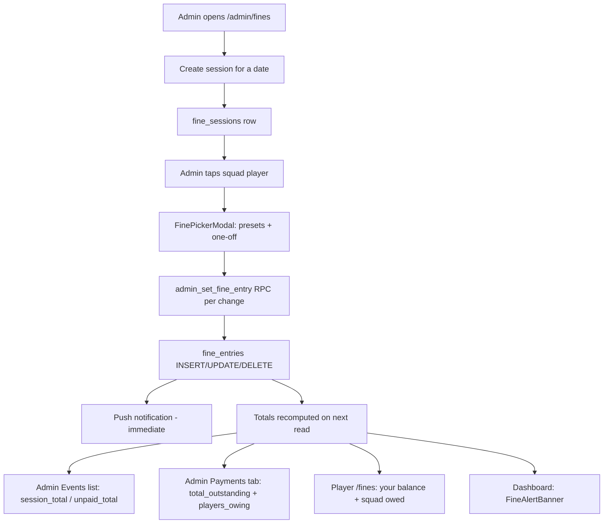

# BMFC Fines System

> **26/27 rework implemented** — see [FINES-REWORK-SPEC.md](./FINES-REWORK-SPEC.md) for the canonical spec. Migrations **037–042** supersede much of this document.

Technical rundown of match-day fines: catalog, totals pipeline, late fees, warning UI, and push notifications.

**Last reviewed:** July 2026

---

## Overview

Match-day fines live in Supabase (`fine_sessions` + `fine_entries`), with admin UI at `/admin/fines` and player UI at `/fines`.

**Signing-on fees** (Admin Finance) are a separate system and do not feed into fines totals or late fees.

---

## 1. List of fines

### Preset match-day fines

Defined in `src/lib/fineCatalog.ts`:

| Key | Label | Amount |
|-----|-------|--------|
| `late` | Late | £1 |
| `sin_bin` | Sin bin | £5 |
| `no_warm_up_top` | No warm up top | £1 |
| `no_show` | No show | £5 |

### One-off fines

- Key format: `oneoff:{uuid}`
- Admin sets custom label and amount
- One one-off per player per event in the UI (DB allows multiple via different UUIDs)

### System-generated late payment fee

- Key: `late_fee`
- Label: `Late payment fee`
- Amount: **£2** (hardcoded in SQL migration 034, not in the catalog)

---

## 2. Pipeline: fine logged → money total

There is no single “totaliser” component — totals are computed at read time from `fine_entries` where `paid = false`.

### Step-by-step

1. **Create event** — Admin picks a date → `admin_create_fine_session` → `fine_sessions` row (title auto-generated from date in migration 035).

2. **Log fines** — Admin taps a squad player → toggles presets / adds one-off → `handleSavePlayerFines` diffs draft vs server and calls `admin_set_fine_entry` for each change:
   - `enabled = true` → upsert into `fine_entries`
   - `enabled = false` → delete
   - Player must be in active `squad`

3. **Mark paid** — Admin Payments tab → “Mark all paid” → `admin_set_fine_paid` sets `paid`, `marked_by`, `marked_at`.

4. **Late fees (automated)** — Daily job calls `apply_fine_late_fees()` (see section 3).

### Where totals appear

| Location | What it shows | How |
|----------|---------------|-----|
| **Admin → Payments tab** | Club-wide **Total outstanding** + **Players owing** | SQL `SUM(amount) WHERE NOT paid` via `admin_list_fine_entries` |
| **Admin → Events list** | Per-event total + unpaid | `session_total`, `unpaid_total` per session |
| **Admin → Event detail** | Event total | `detail.session.session_total` |
| **Admin → Payment cards** | Per-player owed | `finePaymentGroups.ts` → `unpaidTotal` |
| **Player `/fines`** | Your balance | `unpaidTotal(myFines)` client-side |
| **Player `/fines`** | Squad “Who still owes” | `outstanding_total` per player from `list_outstanding_fines_summary` |
| **Dashboard** | Fines banner | `unpaidTotal(myUnpaidFines)` via `useMyUnpaidFines()` |

### Core aggregation (client)

`src/lib/fineAlerts.ts` — `unpaidTotal()` sums all unpaid `fine_entries` amounts.

Admin Payments “totaliser” is the two big cards at the top of the Payments tab — **Total outstanding** and **Players owing**.

---

## 3. Late fees — rules and timing

### Player-facing rule

Copy on `/fines`: *“Pay by the last Sunday of each month.”*

### What gets charged

- **£2 per player per calendar month** if they still have **any unpaid fines** after that month’s **last Sunday** deadline.
- Late fee is its own `fine_entries` row (`fine_key = 'late_fee'`) in a session titled e.g. `Late payment fees - Jun 2026`.

### When it runs

| Mechanism | Schedule | Notes |
|-----------|----------|-------|
| **GitHub Action** | Daily **00:05 UTC** | Primary automation (`.github/workflows/apply-fine-late-fees.yml`) |
| **pg_cron** (optional) | Daily 00:05 UTC | If extension enabled on Supabase (migration 034) |
| **Manual** | On demand | `npm run apply:fine-late-fees` or Edge Function |

### When a charge actually lands

The job runs daily, but a late fee for month M is only applied once:

1. **Last Sunday of month M has passed** (`deadline < CURRENT_DATE`)
2. **No prior run** recorded in `fine_late_fee_runs` for that year/month
3. Player has **any unpaid** `fine_entries` with `created_at::date <= deadline`

So if the deadline is Sunday 29 June, the fee can appear any time from **Monday 30 June** onward (first daily run after the deadline). Worst case: up to ~24 hours after midnight UTC on the Monday.

### Important edge cases

- Counts **all** unpaid fines created on or before the deadline — not just fines from that month.
- A player owing across multiple months gets **one £2 charge per month** they remain unpaid after each deadline.
- Unpaid **late fee entries themselves** can trigger future late fees.
- **No push notification** when late fees are auto-applied.
- Idempotent via `fine_late_fee_runs` — each month processed at most once.

### Implementation

- SQL: `supabase-club/migrations/034_fine_late_fees.sql`
- Function: `apply_fine_late_fees()`
- Helper: `fine_last_sunday_of_month(year, month)`
- Idempotency table: `fine_late_fee_runs`

---

## 4. Warning UI — how and when

Warnings are **purely client-side** — no scheduled jobs, no push. They recalculate whenever the UI loads/re-renders from current unpaid data.

### Scoring (`src/lib/fineAlerts.ts`)

**Amount owed:**

| Threshold | Score |
|-----------|-------|
| ≥ £15 | +3 |
| ≥ £8 | +2 |
| ≥ £4 | +1 |

**Oldest unpaid fine age** (days since `created_at`):

| Threshold | Score |
|-----------|-------|
| ≥ 21 days | +3 |
| ≥ 14 days | +2 |
| ≥ 7 days | +1 |
| ≥ 3 days | +0 |

**Level from total score:**

| Score | Level | Visual |
|-------|-------|--------|
| ≥ 4 | **critical** | Red border/bg, red text, **pulsing animation** (2s loop) |
| ≥ 2 | **warning** | Amber border/bg |
| > 0 | **normal** | Subtle blue styling |
| 0 owed | **none** | Hidden |

### Examples

- £4 owed, 7 days old → 1+1 = **warning**
- £8 owed, 3 days → 2+0 = **warning**
- £15 owed, 21+ days → 3+3 = **critical**
- £2 owed, 1 day → **normal**

### Where warnings show

| Component | Where | Data source |
|-----------|-------|-------------|
| `FineAlertBanner` | Dashboard (if you owe) | `useMyUnpaidFines()` |
| `FineYourBalanceCard` | `/fines` — your balance | `list_my_unpaid_fines` |
| `FineSquadOwedCard` | `/fines` — squad list | `outstanding_total`, `oldest_unpaid_days` from SQL |

Squad cards use SQL for age (`list_outstanding_fines_summary` — `FLOOR(epoch(now() - MIN(created_at)) / 86400)`). Client-side uses the same floor logic in `daysSince()`.

### Timing of warnings

There is **no fixed schedule** — escalation is continuous:

- Day 3+: age contributes (but +0 until day 7)
- Day 7+: warning more likely from age alone
- Day 14 / 21: stronger escalation
- Combined with amount thresholds for critical

Warnings appear as soon as the user opens Dashboard or `/fines` and the data crosses a threshold. No “warning push” or “deadline reminder” exists yet.

### Visual styling

- Critical pulse: `index.css` — `@keyframes fine-alert-pulse` (disabled with `prefers-reduced-motion`)

---

## 5. Push notifications — what and when

### Only one fines push type exists today

**Trigger:** Admin saves fines for a player (`handleSavePlayerFines` → `sendFinePushNotification`).

**When:** Immediately after a successful save — not scheduled.

**Payload:**

- Title: `New fine added`
- Body: `{fine labels} · £{total owed}`
- URL: `/fines`
- Target: that player only (`player_ids: [playerId]`)

**What triggers it:**

- Fines **enabled/added** in the current save batch (`updates.filter(u => u.enabled)`)

**What does NOT trigger it:**

- Removing fines
- Marking paid/unpaid
- Creating an empty session
- **Late fee automation**
- Warning escalation

### Delivery chain

1. `src/lib/finePush.ts` → `invokeSendPush()`
2. Supabase Edge Function `send-push`
3. Web Push (VAPID) → `push_subscriptions`
4. Service worker (`src/sw.ts`)

Requires the player to have push enabled and a subscription stored. Errors are swallowed so admin save is never blocked.

---

## 6. Quick reference: timings

| Event | Timing |
|-------|--------|
| Payment deadline | Last **Sunday** of each month |
| Late fee job runs | Daily **00:05 UTC** |
| Late fee applied | First run **after** last Sunday passes (up to ~24h later) |
| Late fee amount | **£2**/player/month still owing |
| Warning UI | Real-time on page load — based on amount + age |
| Push on new fine | **Immediate** when admin saves |
| Push on late fee | **Never** |
| Push on deadline/warning | **Never** |

---

## 7. Database schema and migrations

| Migration | Purpose |
|-----------|---------|
| **032** | Core schema + all fines RPCs |
| **033** | `admin_delete_fine_session` |
| **034** | Late fees + `fine_late_fee_runs` + optional pg_cron |
| **035** | Auto-generate session title from date |
| **036** | Auto squad row on profile approval (fines eligibility) |

### Tables

- **`fine_sessions`** — `id`, `session_date`, `title`, `notes`, `logged_by`, `created_at`
- **`fine_entries`** — `id`, `session_id`, `profile_id`, `fine_key`, `label`, `amount`, `paid`, `marked_by`, `marked_at`, `logged_by`, `created_at` (unique on `session_id, profile_id, fine_key`)
- **`fine_late_fee_runs`** — `period_year`, `period_month`, `players_charged`, `total_amount`, `applied_at`

All reads/writes go through `SECURITY DEFINER` RPCs; direct table access blocked by RLS.

---

## 8. Key files

### Library / logic

- `src/lib/fineCatalog.ts` — preset types, amounts
- `src/lib/fineAlerts.ts` — warning level scoring
- `src/lib/finePush.ts` — fine push notification
- `src/lib/finePaymentGroups.ts` — group entries by player for admin payments
- `src/lib/finePlayerCopy.ts` — player-facing strings
- `src/lib/clubApi.ts` — fines API wrappers

### Pages

- `src/pages/AdminFines.tsx` — admin log + payments
- `src/pages/Fines.tsx` — player fines page
- `src/pages/Dashboard.tsx` — `FineAlertBanner` integration

### Components (`src/components/fines/`)

- `FineAlertBanner.tsx` — dashboard warning
- `FineYourBalanceCard.tsx` — player balance + line items
- `FineSquadOwedCard.tsx` — expandable squad owed card
- `FinePickerModal.tsx` — admin fine picker
- `FineTypeGrid.tsx` — preset fine toggles
- `FineOneOffSection.tsx` — custom fine form
- `FinePlayerPaymentCard.tsx` — admin grouped payment card

### Automation

- `.github/workflows/apply-fine-late-fees.yml`
- `scripts/apply-fine-late-fees.mjs`
- `supabase-club/functions/apply-fine-late-fees/index.ts`

---

## 9. Known gaps

1. **No proactive deadline reminders** — players only see “pay by last Sunday” copy and escalating UI; nothing fires before/on the deadline.
2. **Late fees are silent** — £2 added with no push; players discover it on next visit to `/fines` or Dashboard.
3. **Warnings are visual only** — no push at warning/critical levels.
4. **Late fee timing is “day after deadline”** not “on deadline evening” — depends on the 00:05 UTC cron.

### Main levers for changes

- `supabase-club/migrations/034_fine_late_fees.sql` — late fee logic/schedule
- `src/lib/fineAlerts.ts` — warning thresholds
- `src/lib/finePush.ts` — what gets pushed and when
