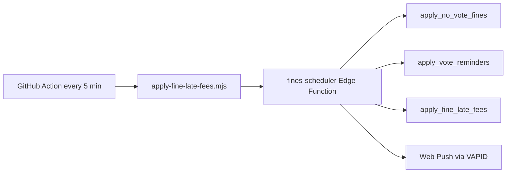

# BMFC Fines System

> Canonical spec: [FINES-REWORK-SPEC.md](./FINES-REWORK-SPEC.md). Migrations **037–043** describe the live 26/27 rework.

Technical rundown of match-day fines: catalogue, due dates, automation, late fees, warning UI, and push notifications.

**Last reviewed:** July 2026

---

## Overview

Match-day fines live in Supabase (`fine_sessions` + `fine_entries`), with admin UI at `/admin/fines` and player UI at `/fines`.

**Signing-on fees** (Admin Finance) are a separate system and do not feed into fines totals or late fees.

---

## 1. Fine catalogue

Defined in `src/lib/fineCatalog.ts`:

| Key | Label | Amount | Notes |
|-----|-------|--------|-------|
| `late` | Late | £1 | Cycling lateness tile (mutually exclusive with `late_10`) |
| `late_10` | Late 10+ mins | £2 | 10+ minutes late for a match |
| `no_show` | No show | £5 | |
| `sin_bin` | Sin bin | £5 | £12 yellow-card payment is outside the app |
| `no_vote` | No vote | £1 | Auto-applied; also manually toggleable |
| `non_club_attire` | Non-club attire | £1 | Replaces removed picker preset `no_warm_up_top` |

**Discretional fines** — key `oneoff:{uuid}`, user-facing label “Discretional fine”.

**System-generated:** `late_fee` — “Late payment fee”, £2, not in the catalogue.

Legacy rows with `no_warm_up_top` or other absent keys still render from stored `label` and `amount`.

---

## 2. Due dates

Every `fine_entries` row has `due_date` (migration **037**).

**Grace rule** (`fine_due_date(created date)`):

1. Let `LS` = last Sunday of the creation month.
2. If created on or before the penultimate Sunday (`LS - 7 days`), `due_date = LS`.
3. Otherwise `due_date` = last Sunday of the **following** month.

**Exception:** `late_fee` rows get `due_date =` application date (immediately due; weekly compounding works).

Player copy on `/fines` explains the grace window and £2/week after due date.

---

## 3. Weekly late payment fees

**Rule:** On the **first successful tick of each ISO week**, charge **£2** to each player with any unpaid entry where `due_date < CURRENT_DATE`, excluding paused players.

- Idempotency: `fine_late_fee_runs_weekly (period_year, period_week)` using `EXTRACT(ISOYEAR …)` and `EXTRACT(WEEK …)`.
- Function: `apply_fine_late_fees()` (migrations **038**, **039**).
- Session title pattern: `Late payment fees - w/c DD Mon YYYY`.
- Push: “Late payment fee added” (from `fines-scheduler` Edge Function).

The old monthly model (`fine_late_fee_runs`) is retained for history only.

---

## 4. Player pause

`squad.paused` (migration **039**) freezes **automation only**:

- No auto no-vote fines
- No vote reminder pushes
- No weekly late fees (existing debt frozen, not cleared)

Manual admin fines still work. Toggle in Admin Fines squad list. RPC: `admin_set_player_pause`.

---

## 5. Automated no-vote fines

**Rule:** After event start, each active non-paused squad member with **no** `availability` row for that fixture/training gets £1 `no_vote`, with a push.

- Function: `apply_no_vote_fines()` (migrations **040**, **041**, **043**).
- Idempotency: `fine_no_vote_runs (event_type, event_id)` — per event, not per player. Admin removal is final.
- Fixture start: `fixture_start_time(match_date, kickoff_time)` — combines London calendar date + `kickoff_time`.
- **TBC fixtures** (`kickoff_time IS NULL`) are **skipped** until kickoff is set (migration **043**).
- Training: full `session_date` timestamptz.
- 7-day lookback prevents ancient events firing when kickoff is confirmed late.

---

## 6. Vote reminders

**Rule:** T-48h and T-24h pushes to non-voters (not fines).

- Function: `apply_vote_reminders()` (same migrations as no-vote).
- Idempotency: `fine_vote_reminder_runs (event_type, event_id, reminder_kind)`.
- Push URL: **`/dashboard`** (availability voting lives there).
- TBC fixtures excluded (migration **043**).

---

## 7. Automation architecture



| Component | Role |
|-----------|------|
| `.github/workflows/fines-automation.yml` | **Canonical trigger** — every **5 minutes** + `workflow_dispatch` |
| `scripts/apply-fine-late-fees.mjs` | HTTP invoke with 3× retry; loud warning + RPC fallback if scheduler unavailable |
| `supabase-club/functions/fines-scheduler/index.ts` | Orchestrator: SQL steps + pushes |
| Migration **043** | Unschedules legacy pg_cron jobs from migration 034 |

**No pg_cron** fines jobs should exist in production. Migration 042 remains a historical placeholder only.

### Ops risks

- **GitHub Actions secrets:** Add `VITE_SUPABASE_URL` and `SUPABASE_SERVICE_ROLE_KEY` under repo **Settings → Secrets and variables → Actions** (same as DDSFL sync). Optional: `FINES_SCHEDULER_SECRET` if set on the Supabase Edge Function. Without secrets the workflow fails every 5 minutes and GitHub emails you.
- **Deploy `fines-scheduler`:** `supabase functions deploy fines-scheduler --project-ref YOUR_REF` after auth changes.
- **GitHub Actions 60-day rule:** Scheduled workflows **auto-disable** after 60 days without repo commits. Mitigation: any commit re-enables; manually re-enable under Actions → Fines automation; consider a monthly off-season calendar reminder.
- **Workflow failure:** Job exits non-zero if scheduler and RPC fallback both fail — GitHub emails on failure.
- **Fallback RPC path:** Charges late fees only — **no** no-vote, **no** reminders, **no** pushes that tick.

### Verification queries (production)

```sql
-- No fines pg_cron jobs (or pg_cron extension absent)
SELECT jobid, jobname, schedule, command FROM cron.job;

-- Upcoming automatable fixtures
SELECT id, opponent, match_date, kickoff_time,
       public.fixture_start_time(match_date, kickoff_time) AS start_time
FROM fixtures
WHERE status IN ('scheduled', 'in_progress')
ORDER BY start_time;

-- Recent weekly late-fee runs
SELECT * FROM fine_late_fee_runs_weekly ORDER BY applied_at DESC LIMIT 5;
```

---

## 8. Push notifications (four types)

All via `fines-scheduler` (automation) or `sendFinePushNotification` (admin save) → `send-push` Edge Function → Web Push.

| Trigger | Title | When |
|---------|-------|------|
| Admin saves new fine(s) | New fine added | Immediate on save |
| Auto no-vote | No vote fine | After event start |
| Vote reminder | Vote reminder | T-48h / T-24h |
| Weekly late fee | Late payment fee added | First ISO-week tick with eligible debt |

Errors are swallowed so automation and admin saves never block.

Secrets: `VAPID_PUBLIC_KEY`, `VAPID_PRIVATE_KEY`, `VAPID_SUBJECT` on the Supabase project.

---

## 9. Warning UI

Client-side scoring in `src/lib/fineAlerts.ts` — recalculates on page load.

**Amount owed:** ≥ £15 +3, ≥ £8 +2, ≥ £4 +1.

**Deadline proximity** (earliest unpaid `due_date`, Europe/London “today”):

| `days_until` | Score |
|--------------|-------|
| &lt; 0 (overdue) | +3 |
| 0–3 | +2 |
| 4–7 | +1 |
| &gt; 7 | +0 |

**Levels:** ≥ 4 critical (red pulse), ≥ 2 warning (amber), &gt; 0 normal, nothing owed hidden.

Shown on `FineAlertBanner` (dashboard), `FineYourBalanceCard`, `FineSquadOwedCard` (with due-date copy).

---

## 10. Admin UI

- **Cycling lateness tile:** off → Late £1 → Late 10+ £2 → off.
- **Grid:** lateness + No show, Sin bin, No vote, Non-club attire.
- **Discretional fine** section (was “One-off”).
- **Pause** toggle per squad member on Log fines tab.
- Saves call `admin_set_fine_entry` **sequentially** (lateness exclusivity enforced server-side too).

---

## 11. Database migrations (fines)

| Migration | Purpose |
|-----------|---------|
| **032** | Core schema + RPCs |
| **034** | Monthly late fees (superseded; pg_cron job removed by **043**) |
| **037** | `due_date`, `fine_due_date()`, trigger |
| **038** | Weekly late fees + `fine_late_fee_runs_weekly` |
| **039** | Squad pause + pause filter on late fees |
| **040** | No-vote + vote reminders + seeding |
| **041** | RPC updates (due_date reads, lateness exclusivity) |
| **042** | Scheduler cron placeholder (historical) |
| **043** | Unschedule pg_cron; TBC fixture exclusion |

---

## 12. Key files

- **SQL:** `supabase-club/migrations/037`–`043`, functions `apply_no_vote_fines`, `apply_vote_reminders`, `apply_fine_late_fees`
- **Edge Function:** `supabase-club/functions/fines-scheduler/index.ts`
- **Automation:** `.github/workflows/fines-automation.yml`, `scripts/apply-fine-late-fees.mjs`
- **Frontend:** `src/lib/fineCatalog.ts`, `fineAlerts.ts`, `finePlayerCopy.ts`, `src/pages/AdminFines.tsx`, `src/components/fines/*`

---

## 13. Manual admin pipeline

1. Create session (date) → `admin_create_fine_session`
2. Tap player → `FinePickerModal` → diff → `admin_set_fine_entry` per change
3. Mark paid → Payments tab → `admin_set_fine_paid`

Totals are computed at read time from unpaid `fine_entries`.
