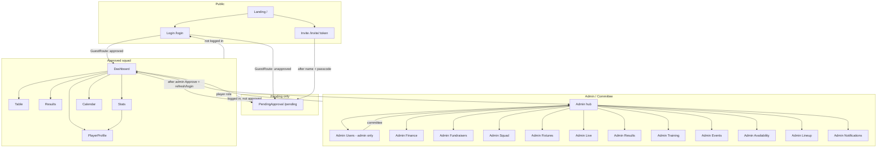
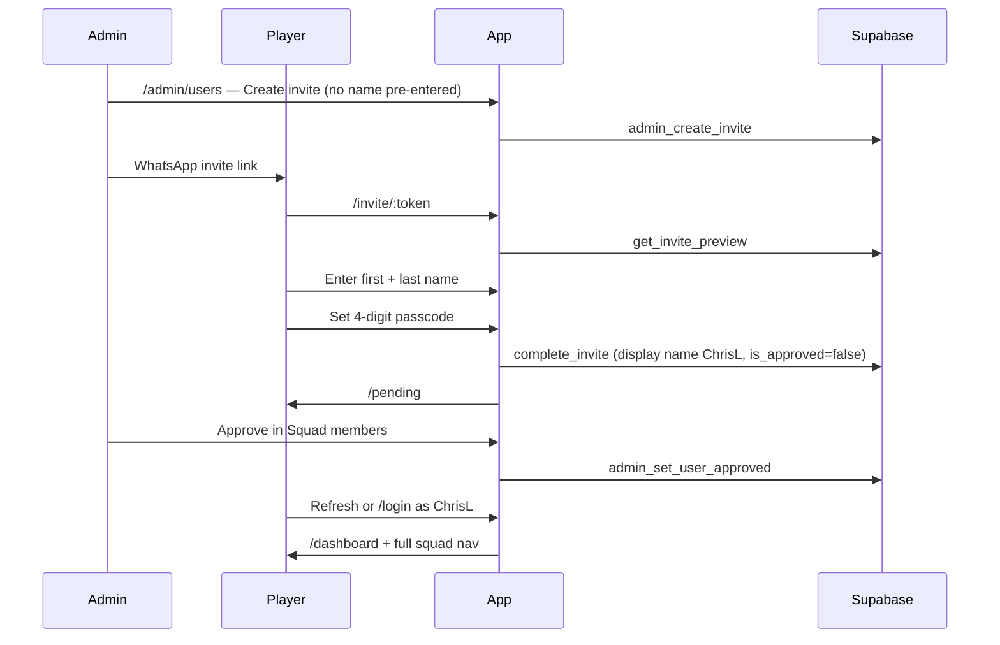

# BMFC Club Hub — Pages & How They Connect

**25 routed pages** (+ 6 legacy redirects). Admin routes are lazy-loaded. All routes live in `src/App.tsx`.

---

## Page inventory

### Public (no login required)

| Route | File | Purpose |
|-------|------|---------|
| `/` | `Landing.tsx` | Marketing home — features, login CTA |
| `/login` | `Login.tsx` | Display name (e.g. **ChrisL**) + 4-digit passcode sign-in |
| `/invite/:token` | `Invite.tsx` | Enter first/last name, then set passcode from admin invite link |
| `*` (catch-all) | `NotFound.tsx` | Branded 404 |

### Auth gate (special)

| Route | File | Guard | Purpose |
|-------|------|-------|---------|
| `/pending` | `PendingApproval.tsx` | `ProtectedRoute allowPending` | Waiting screen after invite setup, before admin approval |
| — | `ConfigRequired.tsx` | Replaces entire app | Shown when `VITE_CLUB_DATA_SOURCE=supabase` but env vars missing |

### Squad app (approved players)

| Route | File | Guard | Purpose |
|-------|------|-------|---------|
| `/dashboard` | `Dashboard.tsx` | `ProtectedRoute` | Home — league position, next match, mark availability |
| `/table` | `LeagueTable.tsx` | `ProtectedRoute` | DDSFL league table |
| `/results` | `Results.tsx` | `ProtectedRoute` | Upcoming fixtures + completed results |
| `/stats` | `Stats.tsx` | `ProtectedRoute` | Squad stats (goals, assists, MOTM, etc.) |
| `/calendar` | `Calendar.tsx` | `ProtectedRoute` | Matches, training, events, fundraisers + availability |
| `/player/:playerId` | `PlayerProfile.tsx` | `ProtectedRoute` | Individual player stats, photo, performance chart, own availability & passcode |

### Admin (committee or admin)

| Route | File | Guard | Who can access |
|-------|------|-------|----------------|
| `/admin` | `Admin.tsx` | `adminOnly` | Admin + committee — hub of admin tools |
| `/admin/finance` | `AdminFinance.tsx` | `adminOnly` | Admin + committee — sponsorships, expenses, balance dashboard |
| `/admin/fundraisers` | `AdminFundraisers.tsx` | `adminOnly` | Admin + committee — fundraiser participation |
| `/admin/squad` | `AdminSquad.tsx` | `adminOnly` | Admin + committee — squad list & positions |
| `/admin/fixtures` | `AdminFixtures.tsx` | `adminOnly` | Admin + committee — add/edit matches |
| `/admin/live` | `AdminLive.tsx` | `adminOnly` | Admin + committee — pick fixture for live matchday |
| `/admin/live/:fixtureId` | `AdminLive.tsx` | `adminOnly` | Admin + committee — log goals, cards & subs in real time |
| `/admin/results` | `AdminResults.tsx` | `adminOnly` | Admin + committee — enter scores, goals, MOTM |
| `/admin/training` | `AdminTraining.tsx` | `adminOnly` | Admin + committee — training sessions |
| `/admin/events` | `AdminEvents.tsx` | `adminOnly` | Admin + committee — socials, AGM, committee meetings |
| `/admin/availability` | `AdminAvailability.tsx` | `adminOnly` | Admin + committee — who's in/out per event |
| `/admin/lineup` | `AdminLineup.tsx` | `adminOnly` | Admin + committee — pick formation & XI |
| `/admin/notifications` | `AdminNotifications.tsx` | `adminOnly` | Admin + committee — push notifications |
| `/admin/users` | `AdminUsers.tsx` | `adminOnly` + `requireAdmin` | **Admin only** — invites, approval, passcodes, name edits |

### Legacy redirects (old World Cup predictor URLs)

| Route | Redirects to |
|-------|----------------|
| `/signup` | `/login` |
| `/leaderboard` | `/table` |
| `/history` | `/results` |
| `/predictions` | `/dashboard` |
| `/admin/ops` | `/admin` |
| `/admin/technical` | `/admin` |

---

## Route guards



| Guard | Behaviour |
|-------|-----------|
| **None** | `/`, `/invite/:token`, `*` |
| **GuestRoute** | `/login` — approved → `/dashboard`; pending → `/pending` |
| **ProtectedRoute** | Must be logged in + `is_approved` |
| **ProtectedRoute allowPending** | Logged in OK even if not approved — `/pending` only |
| **ProtectedRoute adminOnly** | Admin **or** committee; players → `/dashboard` |
| **ProtectedRoute requireAdmin** | Admin only; committee → `/admin` |
| **ConfigRequired** | Whole app blocked if Supabase env missing at build time |

---

## Global navigation

### Navbar (`Navbar.tsx`)

- **Logged out:** logo → `/`, Login button
- **Pending:** logo → `/`, Logout only
- **Approved (desktop):** Table, Results, Stats, Calendar, name → `/player/:id`, Admin (if committee/admin), Logout
- **Approved (mobile):** logo + first name only (full nav is bottom bar)

### Mobile bottom nav (`MobileBottomNav.tsx`)

- Only shown when `user.is_approved`
- Tabs: **Home** (`/dashboard`), **Results**, **Table**, **Calendar**, **Stats**
- Account menu (FAB): My profile, change passcode, push toggle, Admin (committee/admin), Logout

---

## Onboarding flow



---

## Page interactions (links & data)

### Landing → Login → Squad

| From | To | How |
|------|-----|-----|
| `/` | `/login` | Hero CTA |
| `/login` | `/dashboard` | Successful login (if approved) |
| `/login` | `/pending` | GuestRoute if session exists but not approved |
| `/invite/:token` | `/pending` | After name + passcode saved |
| `/invite/:token` | `/login` | Invalid/expired link, or “Already set up?” |
| `/pending` | `/` | “Back to home” |
| `/pending` | `/dashboard` | After admin approval + refresh/login |

### Squad hub (Dashboard)

**Dashboard** pulls: league position, next fixture, availability for next match.

| From | To | How |
|------|-----|-----|
| `/dashboard` | `/calendar` | “Calendar →” link |
| `/dashboard` | `/results` | “All results →” link |
| Bottom nav / Navbar | `/table`, `/results`, `/stats`, `/calendar` | Primary navigation |

### Stats ↔ Player profile

| From | To | How |
|------|-----|-----|
| `/stats` | `/player/:id` | Tap any player row/card in `SquadStatsView` |
| `/stats` | `/admin/results` | Empty state CTA (admin/committee) |
| `/player/:id` | `/stats` | “← Squad stats” |
| Navbar / account menu | `/player/:yourId` | Your name / “My profile” |

**Player profile** shows stats, photo, and performance radar for any squad member. On **your own** profile: availability editing and change-passcode modal.

### Calendar & availability

| Page | Availability |
|------|----------------|
| `/dashboard` | Mark in/out/maybe for **next fixture** |
| `/calendar` | Mark for all upcoming fixtures + training (list or month view) |
| `/player/:yourId` | Same calendar items on own profile |

Calendar also shows **events** (socials, AGM) and **fundraisers** (committee-managed participation).

**Admin availability** (`/admin/availability`) reads everyone’s responses for a selected fixture/training — committee overview, not player-facing.

### Results & fixtures

| Page | Content |
|------|---------|
| `/results` | Player view — upcoming vs completed tabs |
| `/admin/fixtures` | Create/edit manual fixtures; link to enter result or live matchday |
| `/admin/fixtures` → `/admin/results` | “Edit result” for a fixture |
| `/admin/fixtures` → `/admin/live/:id` | Start live logging during a match |
| `/admin/results` | Enter scores, scorers, MOTM, cards — feeds **Stats** |
| `/admin/live/:fixtureId` | Real-time goals, cards, subs; draft auto-saved; submit → **Results** |

### League table

| Page | Data source |
|------|-------------|
| `/table` | DDSFL standings (synced via `npm run sync:ddsfl`) |
| `/dashboard` | Summary card — position + points |

### Finance (admin/committee)

| Page | Content |
|------|---------|
| `/admin/finance` | Overview: paid/pending sponsorship income, total expenses, net balance, category breakdown charts |
| `/admin/finance` | Sponsorships list — filter by paid status; add/edit/delete with **Logged by** / **Edited by** ledger notes |
| `/admin/finance` | Expenses list — by category; same ledger transparency |

Finance writes are RPC-gated; `logged_by` is captured server-side from the session.

---

## Admin hub structure

**`/admin`** is the index. All sub-pages have “← Admin” back link. Tile order matches `Admin.tsx`.

```mermaid
flowchart LR
  A[/admin hub]

  A --> AU[/admin/users<br/>admin only]
  A --> AFN[/admin/finance]
  A --> AFR[/admin/fundraisers]
  A --> AS[/admin/squad]
  A --> AF[/admin/fixtures]
  A --> ALV[/admin/live]
  A --> AR[/admin/results]
  A --> AT[/admin/training]
  A --> AE[/admin/events]
  A --> AA[/admin/availability]
  A --> AL[/admin/lineup]
  A --> AN[/admin/notifications]

  AU -->|creates| INV[/invite/:token]
  AS -->|positions for| S[/stats]
  AF --> ALV
  AF --> AR
  ALV --> AR
  AR --> S
  AT --> C[/calendar]
  AE --> C
  AFR --> C
  AA --> C
  AL --> C
  AN -->|deep link default| C
  AFN -->|standalone| AFN
```

| Admin page | Feeds into |
|------------|------------|
| **Squad members** | Accounts, invites (no pre-entered name), approval, passcode reset, name edits |
| **Finance** | Sponsorship & expense ledger; overview dashboard |
| **Fundraisers** | Calendar fundraiser events + participation tracking |
| **Squad list** | Who appears in stats/result entry/lineup picker (requires squad row for profiles) |
| **Add match** | Calendar, results, availability, lineup, live matchday |
| **Live matchday** | In-game logging; drafts persist; submits to results |
| **Enter results** | Stats, player profiles, league table (via points) |
| **Training** | Calendar, availability |
| **Other events** | Calendar (socials, AGM, committee meetings) |
| **Availability overview** | Read-only view of player responses |
| **Lineup** | Saved lineups per fixture |
| **Notifications** | Push to squad (`VITE_VAPID_PUBLIC_KEY` on Vercel + `send-push` edge fn) |

---

## Role matrix

| Page | Player | Committee | Admin |
|------|:------:|:---------:|:-----:|
| Landing, Login, Invite | ✅ | ✅ | ✅ |
| Pending | ✅ (if unapproved) | — | — |
| Dashboard, Table, Results, Stats, Calendar, Profile | ✅ | ✅ | ✅ |
| Admin hub + all `/admin/*` except users | ❌ | ✅ | ✅ |
| `/admin/users` | ❌ | ❌ | ✅ |

---

## Shared layout

Almost every page uses:

- **`PageShell`** — background, skip link → `#main-content`
- **`Navbar`** — top nav (except Login/Invite use minimal chrome)
- **`pageContainerClass()`** — consistent padding + mobile nav clearance

**Mobile bottom nav** appears on approved squad pages only (hidden on `/login`, `/pending`, `/admin/*`, Landing).

---

## Quick reference — all routes

```
/                          Landing
/login                     Login (display name + passcode)
/invite/:token             Invite — name + passcode setup
/pending                   Awaiting approval
/dashboard                 Home
/table                     League table
/results                   Fixtures & results
/stats                     Squad stats
/calendar                  Calendar + availability
/player/:playerId          Player profile
/admin                     Admin hub
/admin/users               Squad members (admin only)
/admin/finance             Sponsorships, expenses & balance
/admin/fundraisers         Fundraiser participation
/admin/squad               Squad list
/admin/fixtures            Add match
/admin/live                Live matchday — pick fixture
/admin/live/:fixtureId     Live matchday — log events
/admin/results             Enter results
/admin/training            Training sessions
/admin/events              Other events
/admin/availability        Availability overview
/admin/lineup              Lineup picker
/admin/notifications       Push notifications
*                          404 NotFound

Legacy: /signup /leaderboard /history /predictions /admin/ops /admin/technical → redirects
Config: entire app → ConfigRequired (bad Supabase env at build)
```

---

*Last updated: 20 June 2026 · App at `932308b` · migrations 001–022 applied · [AUDIT.md](AUDIT.md) v9 (95/100)*
