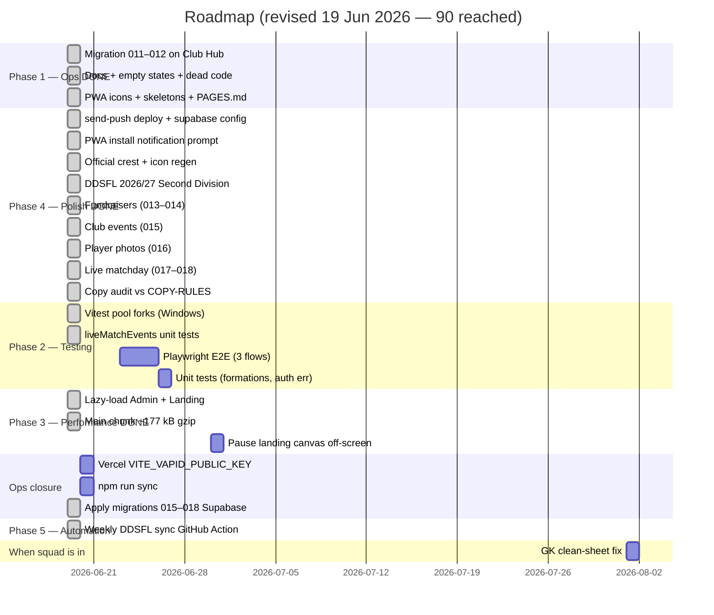

# BMFC Club Hub — Roadmap to 90+ / 100

**Baseline:** [AUDITNEW.md](../AUDITNEW.md) v5 — **90 / 100** (19 June 2026)  
**Target:** **90–91 / 100** — production-grade private squad app  
**Status:** **Target reached** — remaining work is E2E tests and ops polish

---

## Overview

Phase 1, Phase 3 (performance), and most feature work are done. **90/100 achieved.**

Remaining to push toward 91+:

1. **Testing** (58/100) — Playwright E2E smoke tests
2. **Ops closure** — Vercel VAPID key, production push E2E verification
3. **Optional** — pause landing canvas off-screen; GK clean-sheet fix when squad is in

**Skipped / optional:** Accessibility pass — not required for this closed ~25-player squad app.

**Parked:** GK clean-sheet fix — when squad is in and stats matter.

---

## Score projection

| Milestone | Overall | Status |
|-----------|--------:|--------|
| v2 baseline (19 Jun AM) | 79 | ✅ |
| v3 (Phase 1) | 83 | ✅ |
| v4 (push + crest + DDSFL) | 87 | ✅ |
| **v5 (today)** | **90** | ✅ Lazy routes + live matchday + photos + events |
| After Phase 2 (E2E) | ~91 | Optional stretch |

---

## Timeline (updated)

---

## Phase 1 — Quick wins ✅ (complete)

| Task | Status |
|------|--------|
| Migrations 011–012 on Club Hub | ✅ |
| Empty states, skeletons, dead code wired | ✅ |
| Skip-to-content, PAGES.md, docs cleanup | ✅ |
| `.env.local` template for live dev | ✅ |

---

## Phase 4 — Polish ✅ (complete)

| Task | Status |
|------|--------|
| Deploy `send-push` + VAPID Supabase secrets | ✅ |
| `supabase/config.toml` → `supabase-club/functions/send-push` | ✅ |
| PWA install notification prompt (standalone) | ✅ |
| Official club crest — logo, favicon, PWA icons | ✅ `4f778fd` |
| DDSFL **2026/27** + **Second Division** | ✅ `64c0a6a` |
| Admin Fundraisers + participation summary | ✅ |
| Admin Other events (calendar) | ✅ `68518a5`, migration 015 |
| Player profile photos (admin upload) | ✅ `e9287b1`, migration 016 |
| Live matchday logger + draft persistence | ✅ `d2c31e8`, `1bc5009`, migrations 017–018 |
| Copy alignment vs `COPY-RULES.md` | ✅ `876cae6` |
| Stale fixture filter + “Matches” nav label | ✅ `57c31c1` |
| Migrations 015–018 applied on Club Hub | ✅ Operator confirmed |
| `VITE_VAPID_PUBLIC_KEY` on Vercel + redeploy | ⚠️ Operator |
| Production push E2E test (subscribe + admin send) | ⚠️ After Vercel key |

---

## Phase 2 — Testing depth (optional stretch to 91+)

**Target category:** Testing **58 → 72**

| Task | Status | Notes |
|------|--------|-------|
| Vitest `pool: 'forks'` for Windows | ✅ | CI passes; OneDrive local still flaky |
| `liveMatchEvents` unit tests | ✅ `d2c31e8` |
| Playwright E2E: login → dashboard | Open | Mock mode or dev bypass |
| Playwright E2E: set availability | Open | Core player flow |
| Playwright E2E: admin result entry | Open | Core admin flow |
| Unit tests for `lineupFormations.ts` | Open | Pure logic |
| Unit tests for `getAuthErrorMessage` | Open | Auth error mapping |

---

## Phase 3 — Performance ✅ (complete)

**Target category:** Performance **55 → 72** — achieved

| Task | Status |
|------|--------|
| `React.lazy()` for `/admin/*` routes | ✅ `19b2d9f` |
| Lazy-load `Landing` | ✅ `19b2d9f` |
| Main chunk ~630 kB / **~177 kB gzip** (was 231 kB) | ✅ |
| Pause landing canvas off-screen | Open (optional) |

---

## Phase 5 — Automation

| Task | Status |
|------|--------|
| GitHub Action: weekly `sync:ddsfl` | ✅ `.github/workflows/sync-ddsfl.yml` |
| Admin audit log | Open |
| Sentry (optional) | Open |

---

## Phase 6 — Accessibility (optional / skipped)

Not required for this deployment.

| Task | Status |
|------|--------|
| Skip-to-content link | ✅ |
| Passcode fieldset, lineup ARIA, focus trap | ⏭️ Optional |

---

## Phase 7 — When squad is onboarded

| Task | Notes |
|------|-------|
| GK clean-sheet fix + unit test | When 2+ keepers or live stats |
| Invite players via Admin → Squad members | Operational |
| Re-run `sync:ddsfl` during season | After fixtures appear on DDSFL |
| Use Admin → Live matchday on match days | Operational |

---

## Category score targets (v5)

| Category | v4 | v5 | Phase |
|----------|---:|---:|-------|
| Code Quality & Architecture | 85 | 87 | 3 ✅ |
| Security | 68 | 68 | N/A |
| Performance | 55 | 72 | 3 ✅ |
| Accessibility | 53 | 53 | ⏭️ Skipped |
| User Experience | 93 | 95 | 4 ✅ |
| Data Integrity | 75 | 76 | 7 (parked GK) |
| DDSFL Integration | 78 | 80 | Ops |
| Database & Supabase | 92 | 94 | 015–018 ✅ |
| Testing & Reliability | 54 | 58 | 2 (partial) |
| DevOps & Deployment | 96 | 96 | — |
| UI & Design | 92 | 92 | ✅ Done |
| Copy & Content | 88 | 90 | ✅ Done |

---

## Recommended next 3 actions

1. **Add `VITE_VAPID_PUBLIC_KEY` on Vercel** and redeploy — complete push notifications (including live goal alerts).
2. **Run `npm run sync:ddsfl`** — refresh 2026/27 Second Division table when DDSFL publishes fixtures.
3. **Playwright E2E** — login + availability smoke test (optional stretch to 91+).

---

## What you do NOT need for 90+

- Longer passcodes or rate limiting (closed squad)
- GK fix before onboarding starts
- Full WCAG 2.2 AA certification
- Real-time DDSFL sync

---

## Tracking progress

After each phase, update [AUDITNEW.md](../AUDITNEW.md):

1. Run `npm run lint`, `npm run build`, `npm run test:ci`
2. Update category scores and bump version (v5, v6…)
3. Mark checklist items done in this file

---

*Roadmap updated 19 June 2026 (PM). Baseline: AUDITNEW.md v5 (app at `1bc5009`). **90/100 reached.***
