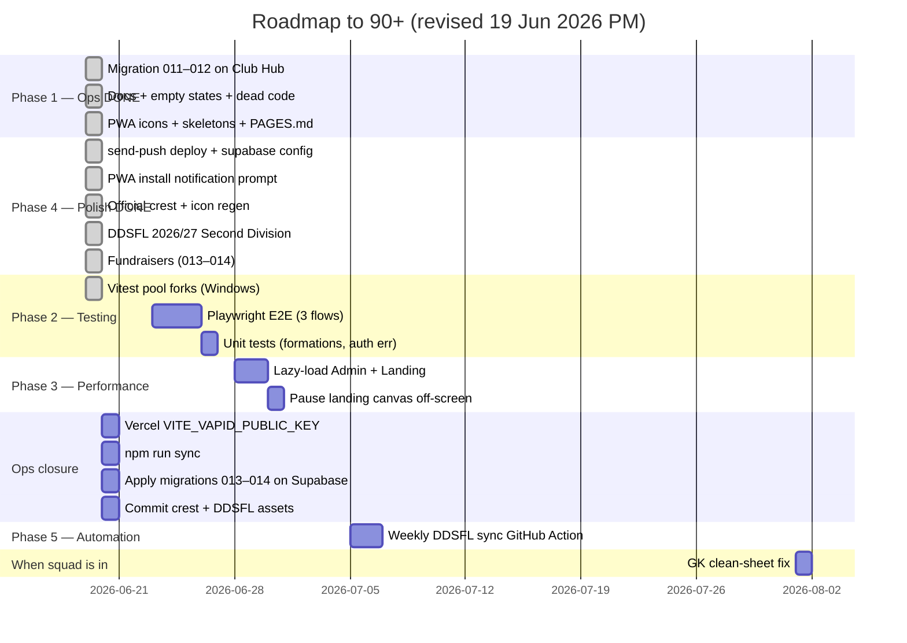

# BMFC Club Hub — Roadmap to 90+ / 100

**Baseline:** [AUDITNEW.md](../AUDITNEW.md) v4 — **87 / 100** (19 June 2026)  
**Target:** **90–91 / 100** — production-grade private squad app  
**Gap to close:** ~3 points  
**Estimated effort:** ~1 week part-time (Phases 2–3)

---

## Overview

Phase 1 and most Phase 4 polish are done. Reaching 90+ now focuses on:

1. **Testing** (54/100) — Playwright E2E smoke tests
2. **Performance** (55/100) — lazy-load admin + landing, smaller first paint
3. **Ops closure** — Vercel VAPID key, `sync:ddsfl` for 2026/27, commit crest assets

**Skipped / optional:** Accessibility pass — not required for this closed ~25-player squad app. Skip link done; revisit only if someone reports friction.

**Parked:** GK clean-sheet fix — when squad is in and stats matter.

---

## Score projection

| Milestone | Overall | Status |
|-----------|--------:|--------|
| v2 baseline (19 Jun AM) | 79 | ✅ |
| v3 (Phase 1) | 83 | ✅ |
| **Today (v4)** | **87** | ✅ Push + crest + DDSFL 2026/27 |
| After Phase 2 (E2E) | ~89 | **Next** |
| After Phase 3 (perf) | **90–91** | Target |

---

## Timeline (updated)

---

## Phase 1 — Quick wins ✅ (complete)

| Task | Status |
|------|--------|
| Migrations 011–012 on Club Hub | ✅ |
| Empty states, skeletons, dead code wired | ✅ |
| Skip-to-content, PAGES.md, docs cleanup | ✅ |
| `.env.local` template for live dev | ✅ |

---

## Phase 4 — Polish ✅ (mostly complete)

| Task | Status |
|------|--------|
| Deploy `send-push` + VAPID Supabase secrets | ✅ |
| `supabase/config.toml` → `supabase-club/functions/send-push` | ✅ |
| PWA install notification prompt (standalone) | ✅ `7db75af` |
| Push subscribe logging + hook error handling | ✅ `7db75af` |
| Official club crest (BMFCWC) — logo, favicon, PWA icons | ✅ Local — **commit pending** |
| DDSFL **2026/27** + **Second Division** | ✅ Local — **commit + sync pending** |
| Admin Fundraisers + participation summary | ✅ `9ed0708`, `14aa9c4` |
| Migrations 013–014 applied on Club Hub | ⚠️ Confirm |
| `VITE_VAPID_PUBLIC_KEY` on Vercel + redeploy | ⚠️ Operator |
| Production push E2E test (subscribe + admin send) | ⚠️ After Vercel key |

---

## Phase 2 — Testing depth ⭐ (next priority)

**Target overall:** ~89 / 100  
**Target category:** Testing **54 → 72**

| Task | Status | Notes |
|------|--------|-------|
| Vitest `pool: 'forks'` for Windows | ✅ `ef7c929` | CI passes; OneDrive local still flaky |
| Playwright E2E: login → dashboard | Open | Mock mode or dev bypass |
| Playwright E2E: set availability | Open | Core player flow |
| Playwright E2E: admin result entry | Open | Core admin flow |
| Unit tests for `lineupFormations.ts` | Open | Pure logic |
| Unit tests for `getAuthErrorMessage` | Open | Auth error mapping |

---

## Phase 3 — Performance

**Target overall:** ~90–91 / 100  
**Target category:** Performance **55 → 72**

| Task | Status |
|------|--------|
| `React.lazy()` for `/admin/*` routes | Open |
| Lazy-load `Landing` | Open |
| Main chunk under ~400 kB gzip | Open |
| Pause landing canvas off-screen | Open |

Current bundle: **808 kB JS (231 kB gzip)** — single chunk.

---

## Phase 5 — Automation

| Task | Status |
|------|--------|
| GitHub Action: weekly `sync:ddsfl` | ✅ `.github/workflows/sync-ddsfl.yml` |
| Admin audit log | Open |
| Sentry (optional) | Open |

---

## Phase 6 — Accessibility (optional / skipped)

Not required for this deployment. Score stays ~53 — acceptable.

| Task | Status |
|------|--------|
| Skip-to-content link | ✅ |
| Passcode fieldset, lineup ARIA, focus trap | ⏭️ Optional |

---

## Phase 7 — When squad is onboarded

| Task | Notes |
|------|-------|
| GK clean-sheet fix + unit test | When 2+ keepers or live stats |
| Invite players via Admin → Squad members | Operational |
| Re-run `sync:ddsfl` during season | After fixtures appear on DDSFL |

---

## Category score targets

| Category | v4 | Target | Phase |
|----------|---:|-------:|-------|
| Code Quality & Architecture | 85 | 88 | 3 |
| Security | 68 | 68 | N/A |
| Performance | 55 | 72 | 3 |
| Accessibility | 53 | 53 | ⏭️ Skipped |
| User Experience | 93 | 94 | Ops (push E2E) |
| Data Integrity | 75 | 82 | 7 (parked) |
| DDSFL Integration | 78 | 85 | Ops + 5 |
| Database & Supabase | 92 | 93 | Ops (013–014) |
| Testing & Reliability | 54 | 72 | 2 |
| DevOps & Deployment | 96 | 97 | Ops + 5 |
| UI & Design | 92 | 92 | ✅ Done |
| Copy & Content | 88 | 88 | Done |

---

## Recommended next 3 actions

1. **Add `VITE_VAPID_PUBLIC_KEY` on Vercel** and redeploy — complete push notifications.
2. **Run `npm run sync:ddsfl`** — load 2026/27 Second Division table into production.
3. **Playwright E2E** — login + availability smoke test (~1 day).

Then: lazy-load admin routes (~half day) → **90+**.

---

## What you do NOT need for 90+

- Longer passcodes or rate limiting (closed squad)
- GK fix before onboarding starts
- Full WCAG 2.2 AA certification
- Real-time DDSFL sync

---

## Tracking progress

After each phase, update [AUDITNEW.md](../AUDITNEW.md):

1. Run `npm run lint`, `npm run build`, `npm run test:ci`
2. Update category scores and bump version (v5, v6…)
3. Mark checklist items done in this file

---

*Roadmap updated 19 June 2026 (PM). Baseline: AUDITNEW.md v4 (app at `7db75af`). ~3 points to 90+.*
