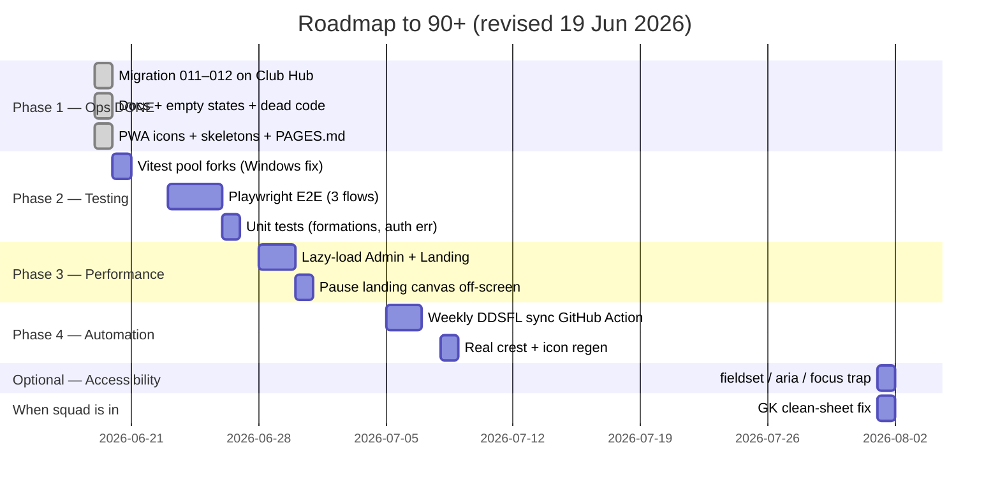

# BMFC Club Hub — Roadmap to 90+ / 100

**Baseline:** [AUDITNEW.md](../AUDITNEW.md) v3 — **83 / 100** (19 June 2026)  

**Target:** **88–91 / 100** — production-grade private squad app (without mandatory a11y pass)  

**Gap to close:** ~5–8 points  

**Estimated effort:** 1–2 weeks part-time (Phase 1 complete)

---

## Overview

Phase 1 is done — Supabase confirmed, invite approval, skeletons, PWA icons, page map documented. Reaching the next tier now focuses on **testing and performance**, not accessibility:

1. **Testing** (54/100) — Vitest Windows fix, unit tests, Playwright E2E

2. **Performance** (55/100) — lazy-load admin + landing, smaller first paint

3. **Automation** (DDSFL weekly sync) — optional but helps sustain score

**Skipped / optional:** Phase 2 accessibility — not required for this closed ~25-player squad app used by able-bodied adults on their own phones. Skip link is already done; only revisit fieldset/ARIA/focus trap if something bothers someone in real use.

**Parked (do when squad is in):** GK clean-sheet fix — not urgent until multiple keepers or stats are live.

---

## Score projection

| Milestone | Overall | Status |

|-----------|--------:|--------|

| v2 baseline (19 Jun AM) | 79 | ✅ |

| **Today (v3)** | **83** | ✅ Phase 1 done |

| After Phase 2 (testing + Vitest fix) | ~87 | **Next** |

| After Phase 3 (perf) | ~90 | |

| After Phase 4 (automation) | **91+** | Target |

*Without the a11y pass, overall score tops out ~2 points lower than a full WCAG-oriented roadmap — acceptable for this deployment.*

---

## Timeline (updated)

---

## Phase 1 — Quick wins ✅ (complete)

**Target:** ~83 / 100 — **achieved**

| Task | Status |

|------|--------|

| Apply migration **011** on Club Hub Supabase | ✅ Confirmed (`lineups` table exists) |

| Apply migration **012** (invite approval gate) | ✅ Applied on Club Hub |

| Invite onboarding: admin approval after passcode | ✅ `2f8d68d` |

| Empty states on Stats + league table | ✅ `1974202` |

| Docs cleanup (README, remove stale audits/COPY) | ✅ `611725d` |

| Wire `getAuthErrorMessage()` | ✅ `8c2c031` |

| Wire `pageContainerClass()` (AdminLineup) | ✅ `4c7f4c1` |

| Wire Skeleton loaders (5 pages) | ✅ `aab9422` |

| Skip-to-content link | ✅ `1974202` |

| PWA icons from `logo.svg` | ✅ `3359bdd` |

| Page map (`docs/PAGES.md`) | ✅ |

| Supabase Club Hub vs predictor identified | ✅ Operator confirmed |

| Fix GK clean sheets | ⏸️ Parked |

| `.env.local` template for live dev | ✅ Created (paste anon key) |

---

## Phase 2 — Testing depth ⭐ (next priority)

**Target overall:** ~87 / 100  

**Target category:** Testing **54 → 72**

| Task | Status | Notes |

|------|--------|-------|

| Vitest `pool: 'forks'` for Windows | ✅ | Fixes OneDrive path worker timeout locally |

| Playwright E2E: login → dashboard | Open | Mock mode or dev bypass |

| Playwright E2E: set availability | Open | Core player flow |

| Playwright E2E: admin result entry | Open | Core admin flow |

| Unit tests for `lineupFormations.ts` | Open | Pure logic |

| Unit tests for `getAuthErrorMessage` | Open | Auth error mapping |

---

## Phase 3 — Performance

**Target overall:** ~90 / 100  

**Target category:** Performance **55 → 72**

| Task | Status |

|------|--------|

| `React.lazy()` for `/admin/*` routes | Open |

| Lazy-load `Landing` | Open |

| Main chunk under ~400 kB gzip | Open |

| Pause landing canvas off-screen | Open |

Current bundle: **804 kB JS (229 kB gzip)** — single chunk.

---

## Phase 4 — Automation & polish

**Target:** Sustain **90+**

| Task | Status |

|------|--------|

| GitHub Action: weekly `sync:ddsfl` | Open |

| Deploy `send-push` + VAPID keys | Open |

| Replace placeholder `logo.svg`; regenerate icons | Open |

| Admin audit log | Open |

| Sentry (optional) | Open |

---

## Phase 5 — Accessibility (optional / skipped)

**Not required** for this closed squad app. Audit score for Accessibility stays ~53 — acceptable.

| Task | Status | Files |

|------|--------|-------|

| Skip-to-content link | ✅ Done | `PageBackground.tsx` |

| Passcode inputs: `fieldset` + `legend` | ⏭️ Optional | `LoginForm.tsx`, `InviteForm.tsx` |

| Lineup slots: `aria-pressed`, `aria-label` | ⏭️ Optional | `AdminLineup.tsx` |

| Admin form labels + `htmlFor` audit | ⏭️ Optional | Admin pages |

| Focus trap on account sheet | ⏭️ Optional | `MobileBottomNav.tsx` |

Only do these if a real user reports friction — not a launch blocker.

---

## Phase 6 — When squad is onboarded

| Task | Notes |

|------|-------|

| GK clean-sheet fix + unit test | Only matters with 2+ keepers or live stats |

| Invite players via Admin → Squad members | Operational, not code |

| Run `npm run sync:ddsfl` at season start | Keep table fresh |

---

## Category score targets (revised — no mandatory a11y)

| Category | v3 | Target | Phase |

|----------|---:|-------:|-------|

| Code Quality & Architecture | 84 | 88 | 3 |

| Security | 68 | 68 | N/A |

| Performance | 55 | 72 | 3 |

| Accessibility | 53 | 53 | ⏭️ Skipped |

| User Experience | 91 | 92 | 4 |

| Data Integrity | 75 | 82 | 6 (parked) |

| DDSFL Integration | 74 | 85 | 4 |

| Database & Supabase | 90 | 90 | Done |

| Testing & Reliability | 54 | 72 | 2 |

| DevOps & Deployment | 94 | 95 | 4 |

| UI & Design | 88 | 90 | 4 (real crest) |

| Copy & Content | 88 | 88 | Done |

---

## Recommended next 3 actions

1. **Playwright E2E** — login + availability smoke test (~1 day).

2. **Lazy-load admin routes** — faster load on squad phones (~half day).

3. **Onboard players** — when ready; create invite → passcode → approve.

---

## What you do NOT need for 90+

- Longer passcodes or rate limiting (closed squad)

- GK fix before onboarding starts

- Full WCAG 2.2 AA certification

- Accessibility pass (fieldset, ARIA, focus trap) unless someone asks

- Real-time DDSFL sync

---

## Tracking progress

After each phase, update [AUDITNEW.md](../AUDITNEW.md):

1. Run `npm run lint`, `npm run build`, `npm run test:ci`

2. Update category scores and bump version (v4, v5…)

3. Mark checklist items done in this file

---

*Roadmap updated 19 June 2026. Baseline: AUDITNEW.md v3 (app at `2f8d68d`). Testing + perf prioritised; a11y optional.*

