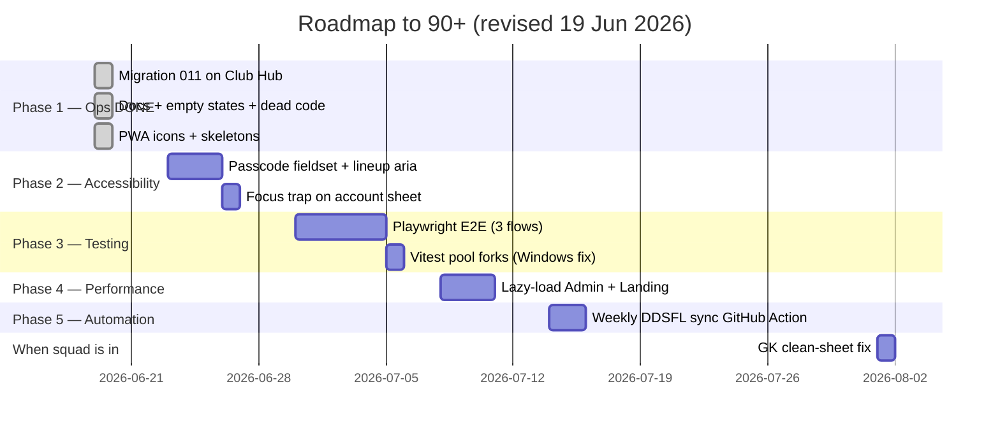

# BMFC Club Hub — Roadmap to 90+ / 100

**Baseline:** [AUDITNEW.md](../AUDITNEW.md) v3 — **83 / 100** (19 June 2026)  
**Target:** **90+ / 100** — production-grade private squad app  
**Gap to close:** ~7 points  
**Estimated effort:** 2–4 weeks part-time (Phase 1 largely complete)

---

## Overview

The app moved from **79 → 83** since the morning audit. Phase 1 quick wins are mostly done — Supabase confirmed, empty states, skeletons, dead code wired, PWA icons committed. Reaching 90+ now focuses on:

1. **Accessibility** (53/100) — skip link done; fieldset, lineup slots, focus trap remain
2. **Testing** (54/100) — E2E + Vitest Windows fix
3. **Performance** (55/100) — code splitting
4. **Automation** (DDSFL weekly sync) — optional but helps sustain score

**Parked (do when squad is in):** GK clean-sheet fix — not urgent until multiple keepers or stats are live.

---

## Score projection

| Milestone | Overall | Status |
|-----------|--------:|--------|
| v2 baseline (19 Jun AM) | 79 | ✅ |
| **Today (v3)** | **83** | ✅ Phase 1 mostly done |
| After Phase 2 (a11y) | ~86 | Next |
| After Phase 3 (tests) | ~89 | |
| After Phase 4 (perf) | **91+** | Target |

---

## Timeline (updated)

---

## Phase 1 — Quick wins ✅ (mostly complete)

**Target:** ~83 / 100 — **achieved**

| Task | Status |
|------|--------|
| Apply migration **011** on Club Hub Supabase | ✅ Confirmed (`lineups` table exists) |
| Apply migration **012** (invite approval gate) | ✅ Applied on Club Hub |
| Invite onboarding: admin approval after passcode | ✅ `2f8d68d` |
| Empty states on Stats + league table | ✅ `1974202` |
| Docs cleanup (README, remove stale audits/COPY) | ✅ `611725d` |
| Wire `getAuthErrorMessage()` | ✅ `8c2c031` |
| Wire `pageContainerClass()` (AdminLineup) | ✅ `4c7f4c1` |
| Wire Skeleton loaders (5 pages) | ✅ `aab9422` |
| Skip-to-content link | ✅ `1974202` |
| PWA icons from `logo.svg` | ✅ `3359bdd` |
| Supabase Club Hub vs predictor identified | ✅ Operator confirmed |
| Fix GK clean sheets | ⏸️ Parked |
| `.env.local` template for live dev | ✅ Created (paste anon key) |

---

## Phase 2 — Accessibility pass

**Target overall:** ~86 / 100  
**Target category:** Accessibility **53 → 68**

| Task | Status | Files |
|------|--------|-------|
| Skip-to-content link | ✅ Done | `PageBackground.tsx` |
| Passcode inputs: `fieldset` + `legend` | Open | `LoginForm.tsx`, `InviteForm.tsx` |
| Lineup slots: `aria-pressed`, `aria-label` | Open | `AdminLineup.tsx` |
| Admin form labels + `htmlFor` audit | Open | Admin pages |
| Focus trap on account sheet | Open | `MobileBottomNav.tsx` |

---

## Phase 3 — Testing depth

**Target overall:** ~89 / 100  
**Target category:** Testing **54 → 72**

| Task | Status |
|------|--------|
| Playwright E2E: login → dashboard | Open |
| Playwright E2E: set availability | Open |
| Playwright E2E: admin result entry | Open |
| Unit tests for `lineupFormations.ts` | Open |
| Unit tests for `getAuthErrorMessage` | Open |
| Vitest `pool: 'forks'` for Windows | Open |

---

## Phase 4 — Performance

**Target overall:** **91+ / 100**  
**Target category:** Performance **55 → 72**

| Task | Status |
|------|--------|
| `React.lazy()` for `/admin/*` routes | Open |
| Lazy-load `Landing` | Open |
| Main chunk under ~400 kB gzip | Open |
| Pause landing canvas off-screen | Open |

Current bundle: **804 kB JS (229 kB gzip)** — single chunk.

---

## Phase 5 — Automation & polish

**Target:** Sustain **90+**

| Task | Status |
|------|--------|
| GitHub Action: weekly `sync:ddsfl` | Open |
| Deploy `send-push` + VAPID keys | Open |
| Replace placeholder `logo.svg`; regenerate icons | Open |
| Admin audit log | Open |
| Sentry (optional) | Open |

---

## Phase 6 — When squad is onboarded

| Task | Notes |
|------|-------|
| GK clean-sheet fix + unit test | Only matters with 2+ keepers or live stats |
| Invite players via Admin → Squad members | Operational, not code |
| Run `npm run sync:ddsfl` at season start | Keep table fresh |

---

## Category score targets at 90+

| Category | v3 | Target | Phase |
|----------|---:|-------:|-------|
| Code Quality & Architecture | 84 | 88 | 4 |
| Security | 68 | 68 | N/A |
| Performance | 55 | 72 | 4 |
| Accessibility | 53 | 68 | 2 |
| User Experience | 91 | 92 | 5 |
| Data Integrity | 75 | 82 | 6 (parked) |
| DDSFL Integration | 74 | 85 | 5 |
| Database & Supabase | 90 | 90 | Done |
| Testing & Reliability | 54 | 72 | 3 |
| DevOps & Deployment | 94 | 95 | 5 |
| UI & Design | 88 | 90 | 5 (real crest) |
| Copy & Content | 88 | 88 | Done |

---

## Recommended next 3 actions

1. **Onboard players** — create invite → player sets passcode → you approve in Squad members; app is ready at 83/100.
2. **Accessibility pass** — passcode `fieldset` + lineup `aria-pressed` (~half day).
3. **Playwright E2E** — login + availability smoke test (~1 day).

---

## What you do NOT need for 90+

- Longer passcodes or rate limiting (closed squad)
- GK fix before onboarding starts
- Full WCAG 2.2 AA certification
- Real-time DDSFL sync

---

## Tracking progress

After each phase, update [AUDITNEW.md](../AUDITNEW.md):

1. Run `npm run lint`, `npm run build`, `npm run test:ci`
2. Update category scores and bump version (v4, v5…)
3. Mark checklist items done in this file

---

*Roadmap updated 19 June 2026. Baseline: AUDITNEW.md v3 (app at `2f8d68d`).*
