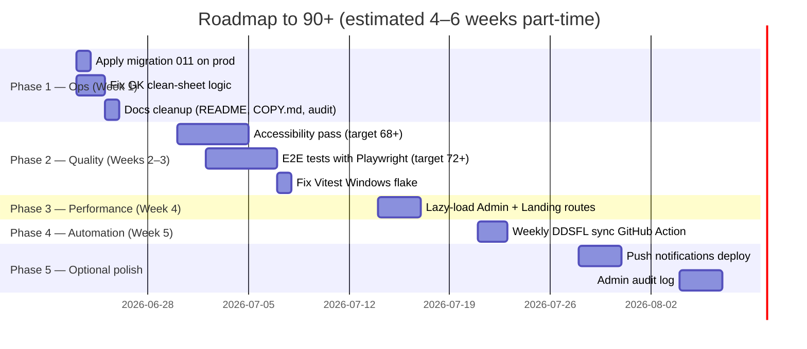

# BMFC Club Hub — Roadmap to 90+ / 100

**Baseline:** [AUDITNEW.md](../AUDITNEW.md) v2 — **79 / 100** (19 June 2026)  
**Target:** **90+ / 100** — production-grade private squad app  
**Gap to close:** ~11 points  
**Estimated effort:** 4–6 weeks part-time

---

## Overview

The app is already **squad-ready** at 79/100. Reaching 90+ is about closing quality gaps in four areas that drag the score down most:

1. **Accessibility** (48/100) — highest leverage per hour invested
2. **Testing** (54/100) — safety net for refactors and season-long maintenance
3. **Performance** (56/100) — code splitting and bundle reduction
4. **Automation** (DDSFL sync, ops tasks) — keeps live data fresh without manual CLI

Security (68/100) is **adequate for closed-squad use** and is explicitly out of scope unless the app goes public.

---

## Score projection

| Milestone | Overall | Key unlock |
|-----------|--------:|------------|
| **Today (baseline)** | **79** | Squad-ready |
| After Phase 1 (ops) | ~83 | Prod lineup + correct stats |
| After Phase 2 (a11y) | ~86 | Usable for wider squad |
| After Phase 3 (tests) | ~89 | Safe to refactor |
| After Phase 4 (perf) | **91+** | Production-grade private app |

---

## Timeline



---

## Phase 1 — Quick wins

**Target overall:** ~83 / 100  
**Duration:** ~1 week  
**Effort:** Low

| Task | Category impact | Effort |
|------|-----------------|--------|
| Apply migration **011** on production Supabase | Database 85→**90**, UX +2 | 15 min |
| Fix GK clean sheets (only count games GK has an appearance event in) | Data 75→**82** | 2–3 hrs |
| Delete/archive `COPY.md`; update README to **001–011**; consolidate audit docs | Copy 83→**88** | 1 hr |
| Add empty-state copy on stats/table when no events | UX 87→**89** | 2 hrs |

### Phase 1 checklist

- [ ] Run `supabase-club/migrations/011_lineups.sql` on production Supabase
- [ ] Update `aggregatePlayerStats()` in `src/lib/playerStats.ts` — clean sheets only when GK has appearance in fixture
- [ ] Add unit test for corrected GK clean-sheet behaviour
- [x] Remove root `COPY.md` (WC predictor content)
- [x] Update `README.md` migration list to 001–011
- [x] Remove superseded audit docs (`AUDIT.md`, `docs/PROJECT-AUDIT.md`)
- [ ] Add empty states to `Stats.tsx` and `LeagueTableView.tsx` when no data

---

## Phase 2 — Accessibility pass

**Target overall:** ~86 / 100  
**Duration:** ~1 week  
**Effort:** Medium  
**Target category score:** Accessibility **48 → 68** (+20)

Minimum viable a11y for squad app — not a full WCAG 2.2 AA audit.

| Task | Points | Files / areas |
|------|--------|---------------|
| Skip-to-content link | +4 | `PageShell`, `App.tsx` |
| Passcode inputs: `aria-labelledby` + fieldset/legend | +3 | `LoginForm.tsx`, `InviteForm.tsx` |
| Lineup slots: `aria-pressed`, `aria-label` per position | +3 | `AdminLineup.tsx` |
| All admin form fields: visible labels + `htmlFor` | +3 | Admin pages |
| Focus trap on modals/sheets (account menu, lineup picker) | +3 | `MobileBottomNav.tsx`, modals |

### Phase 2 checklist

- [ ] Add visually hidden skip link that targets `#main-content`
- [ ] Wrap passcode digit inputs in `<fieldset>` with `<legend>`
- [ ] Add `aria-pressed={isAssigned}` and descriptive `aria-label` to lineup slot buttons
- [ ] Audit admin forms for missing label associations
- [ ] Trap focus in account sheet when open; return focus on close

---

## Phase 3 — Testing depth

**Target overall:** ~89 / 100  
**Duration:** ~1 week  
**Effort:** Medium–high  
**Target category score:** Testing **54 → 72** (+18)

| Task | Points | Notes |
|------|--------|-------|
| Playwright E2E: login (dev bypass + mock) | +4 | Use existing Playwright devDependency |
| Playwright E2E: set availability | +3 | Core player flow |
| Playwright E2E: admin result entry | +3 | Core admin flow |
| Unit tests: `lineupFormations.ts` | +2 | Formation slot mapping |
| Unit tests: `clubAuth` error mapping | +2 | Auth edge cases |
| Fix Vitest Windows flake (`pool: 'forks'`) | +2 | Dev experience |
| Optional: Supabase RPC smoke tests in CI | +5 | Requires test project + secrets |

### Phase 3 checklist

- [ ] Add `e2e/` folder with Playwright config
- [ ] E2E: landing → login (mock mode) → dashboard visible
- [ ] E2E: calendar → set availability → toast/saved state
- [ ] E2E: admin → enter result → stats update
- [ ] Add E2E step to `.github/workflows/ci.yml` (or separate workflow)
- [ ] Unit tests for lineup formations and auth errors
- [ ] Switch Vitest to `pool: 'forks'` in `vite.config.ts` and verify on Windows

---

## Phase 4 — Performance

**Target overall:** **91+ / 100**  
**Duration:** ~3 days  
**Effort:** Medium  
**Target category score:** Performance **56 → 72** (+16)

| Task | Points | Notes |
|------|--------|-------|
| `React.lazy()` for all `/admin/*` routes | +8 | Largest chunk reduction |
| Lazy-load `Landing` page | +2 | Only needed for unauthenticated visitors |
| Keep `framer-motion` in admin chunk only | +4 | Already admin-heavy |
| Pause landing canvas when off-screen | +2 | `LandingHeroBackdrop.tsx` |

### Phase 4 checklist

- [ ] Convert admin page imports in `App.tsx` to `React.lazy()` + `Suspense`
- [ ] Lazy-load `Landing.tsx`
- [ ] Verify build output: main chunk under ~400 kB gzip target
- [ ] Add `IntersectionObserver` to pause/resume landing canvas animation

### Expected build impact

```
Before:  ~788 kB JS (225 kB gzip) — single chunk
After:   ~350 kB main + ~400 kB admin chunk (lazy) — faster first paint
```

---

## Phase 5 — Automation & polish (sustain 90+)

**Target:** Maintain **90+** long-term  
**Duration:** Ongoing  
**Effort:** Low–medium

| Task | Category impact | Effort |
|------|-----------------|--------|
| GitHub Action: weekly `npm run sync:ddsfl` | DDSFL 74→**85** | 2 hrs |
| Deploy `send-push` + VAPID keys | UX +2, DevOps +1 | 3 hrs |
| Admin audit log (invite/result/fixture changes) | Security +3, Data +2 | 1 day |
| Sentry or similar error monitoring | DevOps +2 | 2 hrs |

### Phase 5 checklist

- [ ] Create `.github/workflows/sync-ddsfl.yml` — weekly cron + `SUPABASE_SERVICE_ROLE_KEY` secret
- [ ] Generate VAPID keys (`npm run generate:vapid-keys`)
- [ ] Deploy `supabase-club/functions/send-push/` with secrets
- [ ] Add `admin_audit_log` table + RPC logging on sensitive admin actions
- [ ] Optional: Sentry DSN in Vercel env vars

---

## Category score targets at 90+

| Category | Current | Target | Primary phase |
|----------|--------:|-------:|---------------|
| Code Quality & Architecture | 81 | 88 | Phase 1, 4 |
| Security | 68 | 68 | N/A (closed squad) |
| Performance | 56 | 72 | Phase 4 |
| Accessibility | 48 | 68 | Phase 2 |
| User Experience | 87 | 90 | Phase 1, 5 |
| Data Integrity | 75 | 82 | Phase 1 |
| DDSFL Integration | 74 | 85 | Phase 5 |
| Database & Supabase | 85 | 90 | Phase 1 |
| Testing & Reliability | 54 | 72 | Phase 3 |
| DevOps & Deployment | 92 | 94 | Phase 5 |
| UI & Design | 85 | 88 | Phase 2 |
| Copy & Content | 83 | 88 | Phase 1 |

---

## What you do NOT need for 90+

These are explicitly **out of scope** for a closed ~25-player squad app:

- Longer passcodes or login rate limiting
- Server-side session invalidation on logout
- Full WCAG 2.2 AA certification
- Public-internet security hardening
- Real-time DDSFL sync (weekly is enough)

Revisit these only if the app ever leaves the closed squad context.

---

## Recommended next 3 actions (this week)

1. **Run migration 011** on production Supabase — unblocks lineup save in prod.
2. **Fix GK clean-sheet logic** in `src/lib/playerStats.ts` and add a unit test.
3. **Accessibility quick pass** — skip link + lineup `aria-pressed` (biggest score jump for least effort).

---

## Tracking progress

After completing each phase, update [AUDITNEW.md](../AUDITNEW.md):

1. Re-run `npm run lint`, `npm run build`, `npm run test:ci`
2. Update category scores and overall score
3. Move completed items from bug register / checklist to "Changes since last audit"
4. Bump audit version (v3, v4, …)

---

*Roadmap created 19 June 2026. Baseline: AUDITNEW.md v2 at commit `3296128`.*
