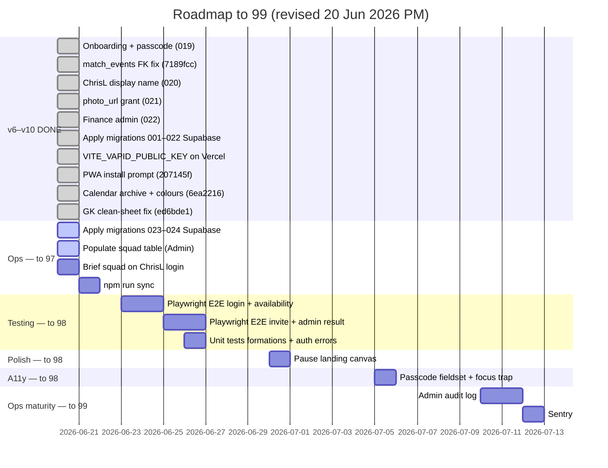

# BMFC Club Hub — Roadmap to 99 / 100

**Baseline:** [AUDIT.md](AUDIT.md) v10 — **96 / 100** (20 June 2026)  
**Target:** **99 / 100** — polished private squad app with strong test coverage and ops closure  
**Status:** **96 reached** — GK fix + calendar polish shipped; apply 023–024, squad + E2E remain

---

## Overview

| Milestone | Score | Status |
|-----------|------:|--------|
| v5 — lazy routes, live matchday, photos | 90 | ✅ |
| v6 — invite onboarding, passcode self-service | 92 | ✅ |
| v7 — prod fixes, ChrisL, photo grant | 93 | ✅ |
| v8 — finance admin (sponsorships + expenses) | 94 | ✅ |
| v9 — all migrations 001–022 on Club Hub | 95 | ✅ |
| **v10 — GK clean sheets, calendar archive, PWA prompt** | **96** | ✅ |
| Apply migrations 023–024 on Club Hub | — | ⚠️ Operator |
| VAPID on Vercel | — | ✅ |
| Ops closure (squad + DDSFL sync) | ~97 | In progress |
| E2E + more unit tests | ~98 | Open |
| Polish (canvas, a11y) | ~98 | Optional |
| Audit log + Sentry | ~99 | Optional |

Remaining lift to **99**:

| Priority | Area | Notes |
|----------|------|-------|
| 1 | **Ops** | Apply 023–024, populate squad, DDSFL sync |
| 2 | **Testing** | Playwright E2E (64 → 85 category score) |
| 3 | **Polish** | Landing canvas pause |
| 4 | **A11y** | Fieldset, focus trap, contrast (optional for closed squad) |
| 5 | **Observability** | Sentry, admin audit log |

---

## Score projection

| Milestone | Overall | Status |
|-----------|--------:|--------|
| v8 — finance admin (79c9688 / 022) | 94 | ✅ |
| v9 — migrations 001–022 applied | 95 | ✅ |
| **v10 — GK fix + calendar + PWA prompt (`ed6bde1`)** | **96** | ✅ |
| Apply migrations 023–024 on Club Hub | — | ⚠️ Operator |
| `VITE_VAPID_PUBLIC_KEY` on Vercel | — | ✅ |
| Ops: squad populated + DDSFL sync | ~97 | ⚠️ Operator |
| E2E smoke tests | ~98 | Open |
| Canvas pause + partial a11y | ~98 | Optional |
| Audit log + Sentry | ~99 | Optional |

---

## Timeline

---

## Phase 6 — Onboarding & auth ✅

| Task | Status | Ref |
|------|--------|-----|
| Admin creates invite without pre-entered name | ✅ | `538e006`, 019 |
| Player enters first + last name on invite | ✅ | 019 |
| Display name **ChrisL** (no space) | ✅ | `8d092a8`, 020 |
| Username **clee** + collision suffix | ✅ | 019 |
| Admin edit names; player change passcode | ✅ | 019 |
| Mock-mode parity | ✅ | |
| Apply 019–020 on production | ✅ | Operator |

---

## Phase 6b — Production hotfixes ✅

| Task | Status | Ref |
|------|--------|-----|
| Dashboard/calendar 400 — dual FK on `match_events` | ✅ | `7189fcc` |
| Stats 400 — `photo_url` column not granted | ✅ | `f91371c`, 021 |
| Calendar fundraisers skip admin RPC for players | ✅ | `7189fcc` |
| Apply migration 021 on production | ✅ | Operator |

---

## Phase 6c — Finance admin ✅

| Task | Status | Ref |
|------|--------|-----|
| Sponsorship CRUD (categories, paid toggle, ledger) | ✅ | `79c9688`, 022 |
| Expense CRUD (categories, ledger) | ✅ | 022 |
| Overview dashboard (paid/pending, net, breakdown charts) | ✅ | `AdminFinance.tsx` |
| Admin + committee access (not admin-only) | ✅ | `assert_finance_user` |
| Server-side `logged_by` / `edited_by` (never client-supplied) | ✅ | 022 RPCs |
| Mock-mode parity | ✅ | `mockFinance.ts` |
| Apply migration 022 on production | ✅ | Operator |

---

## Phase 6d — Calendar & PWA polish ✅

| Task | Status | Ref |
|------|--------|-----|
| Archive vs delete for events and fundraisers | ✅ | `6ea2216`, 023 |
| Match result colour coding on calendar | ✅ | `6ea2216` |
| PWA “Add to home screen” dismissible prompt | ✅ | `207145f` |
| Apply migration 023 on production | ⚠️ | Operator |

---

## Phase 6e — GK clean sheets ✅

| Task | Status | Ref |
|------|--------|-----|
| Layered GK resolution: live log → lineup → manual override | ✅ | `ed6bde1`, `cleanSheet.ts` |
| Keeper subs credited on shutouts (both keepers) | ✅ | |
| Admin → Results optional goalkeeper field | ✅ | `ResultEntryForm.tsx` |
| Admin banner for shutouts missing GK data | ✅ | `AdminResults.tsx` |
| Live log snapshot on result save (`live_log_entries`) | ✅ | migration 024 |
| Unit tests: live, lineup, manual, no-data | ✅ | `cleanSheet.test.ts` |
| Apply migration 024 on production | ⚠️ | Operator |

---

## Phase 1–5 — Previously complete

Migrations 001–018, lazy routes, live matchday, photos, events, fundraisers, copy audit, weekly DDSFL sync, official crest PWA.

---

## Phase 7 — Ops closure (96 → 97)

| Task | Status | Notes |
|------|--------|-------|
| Apply **001–022** on Club Hub | ✅ | |
| Apply **023–024** on Club Hub | ⚠️ | Calendar archive + GK fields |
| `VITE_VAPID_PUBLIC_KEY` on Vercel | ✅ | Production push configured |
| Add squad members (Admin → Squad) | ⚠️ | Required for stats + player profiles |
| Brief squad on **ChrisL** login format | ⚠️ | |
| Push smoke test (Admin → Notifications) | ⚠️ | Optional |
| `npm run sync:ddsfl` | ⚠️ | When fixtures publish |

---

## Phase 2 — Testing depth (97 → 98)

**Target:** Testing **64 → 85**

| Task | Status |
|------|--------|
| `playerNames.ts` unit tests (ChrisL format) | ✅ |
| `liveMatchEvents` unit tests | ✅ |
| `cleanSheet.ts` unit tests (GK attribution) | ✅ |
| Playwright E2E: login → dashboard | Open |
| Playwright E2E: availability | Open |
| Playwright E2E: invite → name → passcode | Open |
| Playwright E2E: admin result entry | Open |
| Unit tests: `lineupFormations.ts` | Open |
| Unit tests: `getAuthErrorMessage` | Open |
| Unit tests: finance overview calculations | Open |

---

## Phase 3 — Performance polish (98)

| Task | Status |
|------|--------|
| Lazy admin routes (~184 kB gzip) | ✅ |
| `AdminFinance` lazy chunk (~3.5 kB gzip) | ✅ |
| Pause landing canvas off-screen | Open |

---

## Phase 8 — Data integrity ✅

| Task | Status |
|------|--------|
| Unique `(first_name, last_name)` | ✅ 019 |
| Display collision `ChrisL2`, `ChrisL3` | ✅ 020 |
| Finance ledger audit trail | ✅ 022 |
| GK clean-sheet attribution | ✅ `ed6bde1`, 024 |

---

## Phase 9 — Accessibility (98)

Optional for ~25-player closed squad.

| Task | Status |
|------|--------|
| Skip-to-content, labelled forms | ✅ |
| Passcode fieldset + modal focus trap | Open |
| Colour contrast spot-check | Open |

---

## Phase 10 — Ops maturity (98 → 99)

| Task | Status |
|------|--------|
| Weekly DDSFL sync Action | ✅ |
| Admin audit log | Open |
| Sentry | Open |
| E2E in CI | Open |

---

## Category score targets (v10 → 99)

| Category | v9 | v10 | @99 | Phase |
|----------|---:|----:|----:|-------|
| Code Quality | 90 | 90 | 91 | 2, 10 |
| Security | 69 | 69 | 70 | N/A |
| Performance | 72 | 72 | 75 | 3 |
| Accessibility | 53 | 53 | 65 | 9 |
| User Experience | 98 | 98 | 99 | 7 |
| Data Integrity | 81 | 85 | 86 | ✅ |
| DDSFL Integration | 80 | 80 | 85 | 7 |
| Database & Supabase | 98 | 98 | 98 | 7 |
| Testing | 62 | 64 | 85 | 2 |
| DevOps | 98 | 98 | 99 | 7, 10 |
| UI & Design | 93 | 93 | 95 | 9 |
| Copy & Content | 91 | 91 | 93 | ✅ |

---

## Recommended next 5 actions

1. **Apply migrations 023 and 024** on Club Hub Supabase (calendar archive + GK clean sheets).
2. **Add squad members** via Admin → Squad (stats and profiles require a squad row).
3. **Brief the squad** on **ChrisL**-style display name login.
4. **Run `npm run sync:ddsfl`** when 2026/27 fixtures publish.
5. **Playwright E2E** — biggest score lift toward 98+.

---

## What you do NOT need for 99

- Public-scale auth (OAuth, MFA, rate limiting)
- Full WCAG 2.2 AA certification
- Real-time DDSFL sync

---

## Tracking progress

1. Run `npm run lint`, `npm run build`, `npm run test:ci`
2. Update [AUDIT.md](AUDIT.md) — bump version and scores
3. Mark items done in this file

---

*Roadmap updated 20 June 2026 (PM). Baseline: AUDIT.md v10 (app at `ed6bde1`). **96/100 reached; target 99.*
