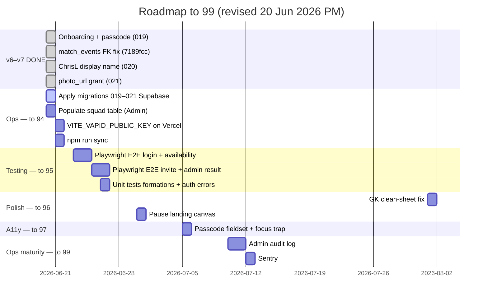

# BMFC Club Hub — Roadmap to 99 / 100

**Baseline:** [AUDITNEW.md](../AUDITNEW.md) v7 — **93 / 100** (20 June 2026)  
**Target:** **99 / 100** — polished private squad app with strong test coverage and ops closure  
**Status:** **93 reached** — onboarding + prod hotfixes shipped; ops + testing remain

---

## Overview

| Milestone | Score | Status |
|-----------|------:|--------|
| v5 — lazy routes, live matchday, photos | 90 | ✅ |
| v6 — invite onboarding, passcode self-service | 92 | ✅ |
| **v7 — prod fixes, ChrisL, photo grant** | **93** | ✅ |
| Ops closure (019–021 + squad + VAPID) | ~94 | In progress |
| E2E + unit tests | ~95 | Open |
| Polish (GK, canvas, a11y) | ~97 | Optional |
| Audit log + Sentry | ~99 | Optional |

Remaining lift to **99**:

| Priority | Area | Notes |
|----------|------|-------|
| 1 | **Ops** | Migrations 019–021, populate squad, VAPID, DDSFL sync |
| 2 | **Testing** | Playwright E2E (61 → 85 category score) |
| 3 | **Polish** | Landing canvas pause, GK fix when relevant |
| 4 | **A11y** | Fieldset, focus trap, contrast (optional for closed squad) |
| 5 | **Observability** | Sentry, admin audit log |

---

## Score projection

| Milestone | Overall | Status |
|-----------|--------:|--------|
| v6 — onboarding (019) | 92 | ✅ |
| **v7 — hotfixes (7189fcc–f91371c)** | **93** | ✅ |
| Ops: 019–021 + squad populated | ~94 | ⚠️ Operator |
| E2E smoke tests | ~95 | Open |
| GK fix + canvas pause | ~96 | Parked / optional |
| Partial a11y | ~97 | Optional |
| Audit log + Sentry | ~99 | Optional |

---

## Timeline

---

## Phase 6 — Onboarding & auth ✅

| Task | Status | Ref |
|------|--------|-----|
| Admin creates invite without pre-entered name | ✅ | `538e006`, 019 |
| Player enters first + last name on invite | ✅ | 019 |
| Display name **ChrisL** (no space) | ✅ | `8d092a8`, 020 |
| Username **clee** + collision suffix | ✅ | 019 |
| Admin edit names; player change passcode | ✅ | 019 |
| Mock-mode parity | ✅ | |
| Apply 019–020 on production | ⚠️ | Operator |

---

## Phase 6b — Production hotfixes ✅

| Task | Status | Ref |
|------|--------|-----|
| Dashboard/calendar 400 — dual FK on `match_events` | ✅ | `7189fcc` |
| Stats 400 — `photo_url` column not granted | ✅ | `f91371c`, 021 |
| Calendar fundraisers skip admin RPC for players | ✅ | `7189fcc` |
| Apply migration 021 on production | ⚠️ | Operator |

---

## Phase 1–5 — Previously complete

Migrations 001–018, lazy routes, live matchday, photos, events, fundraisers, copy audit, weekly DDSFL sync, official crest PWA.

---

## Phase 7 — Ops closure (93 → 94)

| Task | Status | Notes |
|------|--------|-------|
| Apply **019** on Club Hub | ⚠️ | 3-arg DROP + explicit GRANTs |
| Apply **020** on Club Hub | ⚠️ | ChrisL format + backfill |
| Apply **021** on Club Hub | ⚠️ | `GRANT SELECT (photo_url)` |
| Add squad members (Admin → Squad) | ⚠️ | Required for stats + player profiles |
| Brief squad on **ChrisL** login format | ⚠️ | After 020 |
| `VITE_VAPID_PUBLIC_KEY` on Vercel | ⚠️ | |
| `npm run sync:ddsfl` | ⚠️ | When fixtures publish |

---

## Phase 2 — Testing depth (94 → 95)

**Target:** Testing **62 → 85**

| Task | Status |
|------|--------|
| `playerNames.ts` unit tests (ChrisL format) | ✅ |
| `liveMatchEvents` unit tests | ✅ |
| Playwright E2E: login → dashboard | Open |
| Playwright E2E: availability | Open |
| Playwright E2E: invite → name → passcode | Open |
| Playwright E2E: admin result entry | Open |
| Unit tests: `lineupFormations.ts` | Open |
| Unit tests: `getAuthErrorMessage` | Open |

---

## Phase 3 — Performance polish (95 → 96)

| Task | Status |
|------|--------|
| Lazy admin routes (~179 kB gzip) | ✅ |
| Pause landing canvas off-screen | Open |

---

## Phase 8 — Data integrity (96)

| Task | Status |
|------|--------|
| Unique `(first_name, last_name)` | ✅ 019 |
| Display collision `ChrisL2`, `ChrisL3` | ✅ 020 |
| GK clean-sheet over-count | ⏸️ Parked |

---

## Phase 9 — Accessibility (96 → 97)

Optional for ~25-player closed squad.

| Task | Status |
|------|--------|
| Skip-to-content, labelled forms | ✅ |
| Passcode fieldset + modal focus trap | Open |
| Colour contrast spot-check | Open |

---

## Phase 10 — Ops maturity (97 → 99)

| Task | Status |
|------|--------|
| Weekly DDSFL sync Action | ✅ |
| Admin audit log | Open |
| Sentry | Open |
| E2E in CI | Open |

---

## Category score targets (v7 → 99)

| Category | v6 | v7 | @99 | Phase |
|----------|---:|---:|----:|-------|
| Code Quality | 88 | 89 | 90 | 2, 10 |
| Security | 69 | 69 | 70 | N/A |
| Performance | 72 | 72 | 75 | 3 |
| Accessibility | 53 | 53 | 65 | 9 |
| User Experience | 97 | 97 | 98 | 7 |
| Data Integrity | 78 | 80 | 82 | 8 |
| DDSFL Integration | 80 | 80 | 85 | 7 |
| Database & Supabase | 95 | 96 | 96 | 7 |
| Testing | 61 | 62 | 85 | 2 |
| DevOps | 96 | 96 | 99 | 7, 10 |
| UI & Design | 92 | 92 | 94 | 9 |
| Copy & Content | 91 | 91 | 93 | ✅ |

---

## Recommended next 5 actions

1. **Apply migrations 019, 020, 021** on Club Hub Supabase (in order).
2. **Add squad members** via Admin → Squad (stats and profiles require a squad row).
3. **Hard-refresh** production after Vercel deploy (`f91371c`) — dashboard/calendar/stats should load.
4. **Add `VITE_VAPID_PUBLIC_KEY` on Vercel** and redeploy.
5. **Playwright E2E** — biggest score lift toward 95+.

---

## What you do NOT need for 99

- Public-scale auth (OAuth, MFA, rate limiting)
- Full WCAG 2.2 AA certification
- Real-time DDSFL sync

---

## Tracking progress

1. Run `npm run lint`, `npm run build`, `npm run test:ci`
2. Update [AUDITNEW.md](../AUDITNEW.md) — bump version and scores
3. Mark items done in this file

---

*Roadmap updated 20 June 2026 (PM). Baseline: AUDITNEW.md v7 (app at `f91371c`). **93/100 reached; target 99.***
